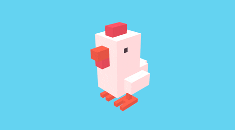

# Web 3D 
<p align="center">
    
</p>

# 🐔 Crossy-Road Game 🎮


## Project Overview

Crossy-Road Game is a 3D web-based game inspired by the classic arcade game Frogger. The objective is to navigate a character across a series of roads and obstacles without getting hit. The game is built using 3D web technologies, providing an engaging and interactive experience.


## Table of contents
* [Features](#features)
* [Installing](#installing)
* [Bibliography & Dependencies](#Bibliography)

## Features

## Installing

You can ether play by using git hub pages adress: 

Or clone project directly on your computer by following these steps:

- Clone or download source-code from this repository
```bash
    gh repo clone ibrahim-sall/crossyroad
```
- Install dependencies with **npm**

```bash
    npm install
```

- Run page with **Vite**

```bash
    npm run dev
```

## Bibliography & Dependencies